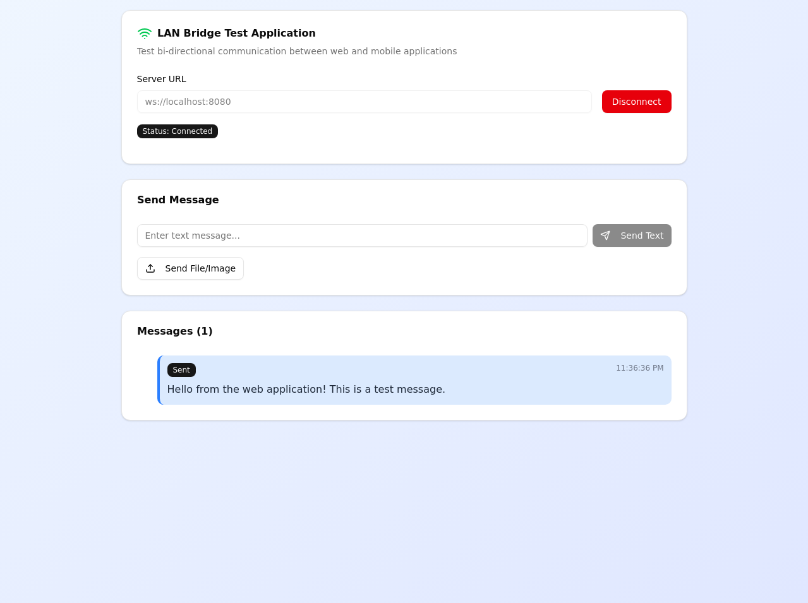

# @diyawanna/lan-bridge-core

A powerful npm module for enabling bi-directional communication between web and mobile applications over local area networks using WebSockets.

## Overview

`@diyawanna/lan-bridge-core` provides a simple yet robust solution for real-time communication between web applications and mobile devices on the same local network. This module is perfect for scenarios where you need to share data, files, or messages between different devices without relying on external servers or internet connectivity.

## Features

- **Real-time Communication**: WebSocket-based bi-directional messaging
- **Multi-platform Support**: Works with web browsers, React Native, Flutter, iOS, and Android
- **File Transfer**: Support for sending images and files between devices
- **Auto-reconnection**: Automatic reconnection with exponential backoff
- **Network Discovery**: Built-in tools for finding servers on the local network
- **Type Safety**: Full TypeScript support
- **Easy Integration**: Simple API with React components included

## Demo

Here's a quick look at the web application demonstrating the LAN Bridge in action:



## Installation

```bash
npm install @diyawanna/lan-bridge-core
```

## Quick Start

### 1. Start the Server

```javascript
const LANBridge = require("@diyawanna/lan-bridge-core");

// Start the WebSocket server
const server = new LANBridge.Server({ port: 8080 });
server.start();

console.log("LAN Bridge server running on port 8080");
```

### 2. Connect from Web Application

```javascript
// Import the client library
import LANBridge from "@diyawanna/lan-bridge-core/client";

// Create a new bridge instance
const bridge = new LANBridge("ws://localhost:8080");

// Connect to the server
await bridge.connect();

// Send a text message
bridge.sendText("Hello from web!");

// Listen for incoming messages
bridge.onMessage("text", (message) => {
  console.log("Received:", message.payload);
});
```

### 3. React Component

```jsx
import React from "react";
import { LANBridgeComponent } from "@diyawanna/lan-bridge-core/react";

function App() {
  return (
    <div>
      <h1>My App</h1>
      <LANBridgeComponent serverUrl="ws://localhost:8080" />
    </div>
  );
}
```

## API Reference

### Server API

#### `new LANBridge.Server(options)`

Creates a new LAN Bridge server instance.

**Options:**
- `port` (number): Port to listen on (default: 8080)
- `host` (string): Host to bind to (default: "0.0.0.0")

**Methods:**
- `start()`: Start the server
- `stop()`: Stop the server
- `getConnectedClients()`: Get list of connected clients

### Client API

#### `new LANBridge(serverUrl)`

Creates a new client instance.

**Parameters:**
- `serverUrl` (string): WebSocket server URL

**Methods:**
- `connect()`: Connect to the server (returns Promise)
- `disconnect()`: Disconnect from the server
- `sendText(text)`: Send a text message
- `sendFile(file)`: Send a file (returns Promise)
- `onMessage(type, handler)`: Register message handler

**Events:**
- `text`: Text message received
- `image`: Image file received
- `file`: File received
- `error`: Error occurred

## Message Protocol

All messages follow a standardized JSON format:

### Text Messages
```json
{
  "type": "text",
  "payload": "Your message content",
  "timestamp": 1640995200000
}
```

### File Messages
```json
{
  "type": "image", // or "file"
  "name": "filename.jpg",
  "payload": "base64_encoded_data",
  "timestamp": 1640995200000
}
```

## Mobile Integration

For detailed instructions on integrating with mobile applications, please refer to the [Mobile Integration Guide](mobile-integration.md).

## Network Discovery

Find LAN Bridge servers on your network:

```javascript
import { NetworkDiscovery } from "@diyawanna/lan-bridge-core";

const discovery = new NetworkDiscovery();
const servers = await discovery.findServers();

console.log("Found servers:", servers);
// Output: ["192.168.1.100:8080", "192.168.1.101:8080"]
```

## Security Considerations

- **Local Network Only**: The server only accepts connections from the local network
- **No Authentication**: Basic version doesn't include authentication (suitable for trusted networks)
- **File Size Limits**: Configurable limits on file uploads
- **Input Validation**: All incoming data is validated

## Examples

### Basic Chat Application

```javascript
// Server
const server = new LANBridge.Server({ port: 8080 });
server.start();

// Web Client
const bridge = new LANBridge("ws://localhost:8080");
await bridge.connect();

bridge.onMessage("text", (message) => {
  displayMessage(message.payload);
});

function sendMessage(text) {
  bridge.sendText(text);
  displayMessage(text, true); // Show as sent
}
```

### File Sharing

```javascript
// Send file from web
const fileInput = document.getElementById("fileInput");
fileInput.addEventListener("change", async (event) => {
  const file = event.target.files[0];
  if (file) {
    await bridge.sendFile(file);
    console.log("File sent:", file.name);
  }
});

// Receive file
bridge.onMessage("file", (message) => {
  console.log("File received:", message.name);
  // File is automatically saved to uploads directory
});
```

## Configuration

### Server Configuration

```javascript
const server = new LANBridge.Server({
  port: 8080,
  host: "0.0.0.0",
  maxFileSize: 10 * 1024 * 1024, // 10MB
  uploadsDir: "./uploads",
  cors: true
});
```

### Client Configuration

```javascript
const bridge = new LANBridge("ws://localhost:8080", {
  reconnectAttempts: 5,
  reconnectDelay: 1000,
  timeout: 30000
});
```

## Troubleshooting

### Connection Issues

1. **Check Network**: Ensure devices are on the same network
2. **Firewall**: Verify port 8080 is not blocked
3. **IP Address**: Use the correct local IP address
4. **Server Status**: Confirm the server is running

### File Transfer Issues

1. **File Size**: Check if file exceeds size limits
2. **Format**: Ensure file format is supported
3. **Network**: Large files may timeout on slow networks

## Contributing

We welcome contributions! Please see our [Contributing Guide](CONTRIBUTING.md) for details.

## License

MIT License - see [LICENSE](LICENSE) file for details.

## Support

- **Documentation**: [Full API Documentation](https://tech.diyawanna.com/docs/lan-bridge)
- **Issues**: [GitHub Issues](https://github.com/Diyawanna/npm-lan-bridge-core/issues)
- **Discussions**: [GitHub Discussions](https://github.com/Diyawanna/npm-lan-bridge-core/discussions)

## Changelog

### v0.0.1 (Initial Release)
- Basic WebSocket server and client
- Text and file messaging
- React component
- Mobile integration examples
- Network discovery utilities

## Publishing

For detailed instructions on how to publish this module to npm, please refer to the [Publishing Guide](PUBLISHING.md).
